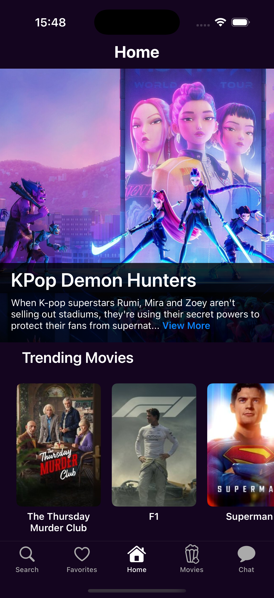
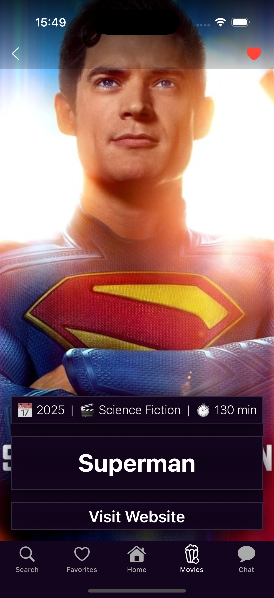
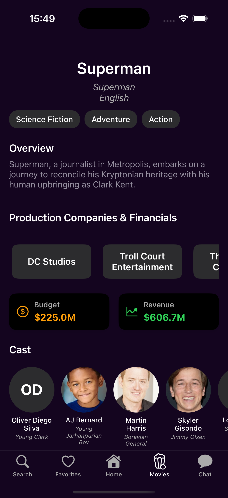
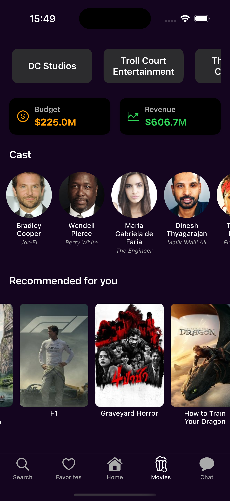
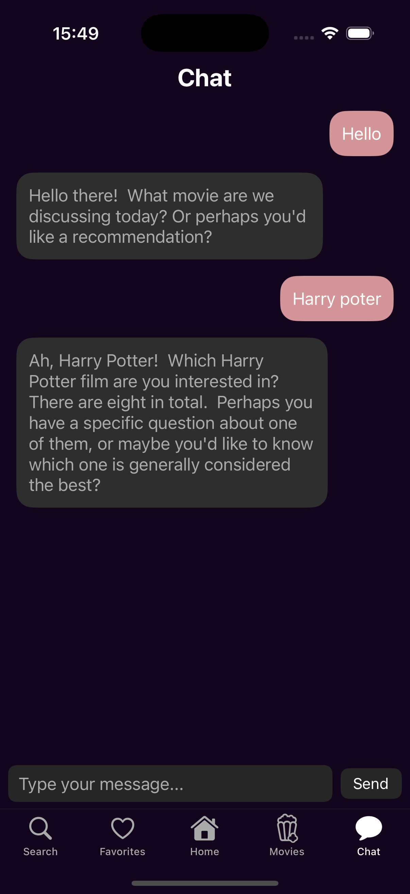
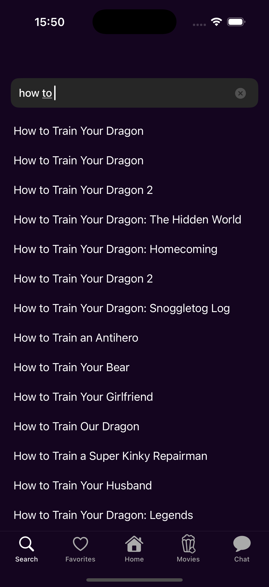
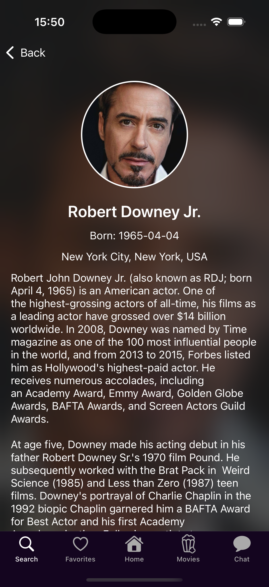

# Filmora 🎬

Filmora, **TMDB API** ve **Gemini API** kullanarak filmleri keşfetmenizi ve film sohbeti yapmanızı sağlayan bir iOS uygulamasıdır. Uygulama, **MVVM mimarisi** ile yazılmıştır ve OBSS 2025 Codecamp staj sürecinde geliştirilmiştir.

---

## Özellikler

- **Ana Ekran Bölümleri**
  - Hero (önerilen/günün filmi)
  - Popular
  - Trending
  - Top Rated
- **Film Detay Sayfası**
  - Görsel, ad, orijinal ad/dil, çıkış tarihi, bütçe, gelir, türler
  - Özet ve süre
  - Yapımcı şirketler ve ana sayfa linki
  - Yatay scroll’lu öneriler listesi
- **Favorilere Ekleme**
  - Kullanıcı filmleri favorilerine ekleyebilir
- **Oyuncu Kadrosu**
  - Sadece aktörler listelenir
  - Her oyuncu için detay sayfasına geçiş
- **Film Sohbeti**
  - **Gemini API** ile film sohbeti yapılabilir
  - **Search**: Film arama
  - **Keşfet**: Popüler ve önerilen sohbet konuları
- **Networking**
  - Moya kullanılarak API çağrıları yapılmıştır

---

## Teknolojiler

- **Language:** Swift  
- **Architecture:** MVVM  
- **Networking:** Moya + TMDB API + Gemini API  
- **Image Loading:** Kingfisher  
- **Skeleton Loading:** SkeletonView  
- **iOS Version:** 16.0+

---

## Fotoğraflar

  
  
  
  
  
  
  
  

